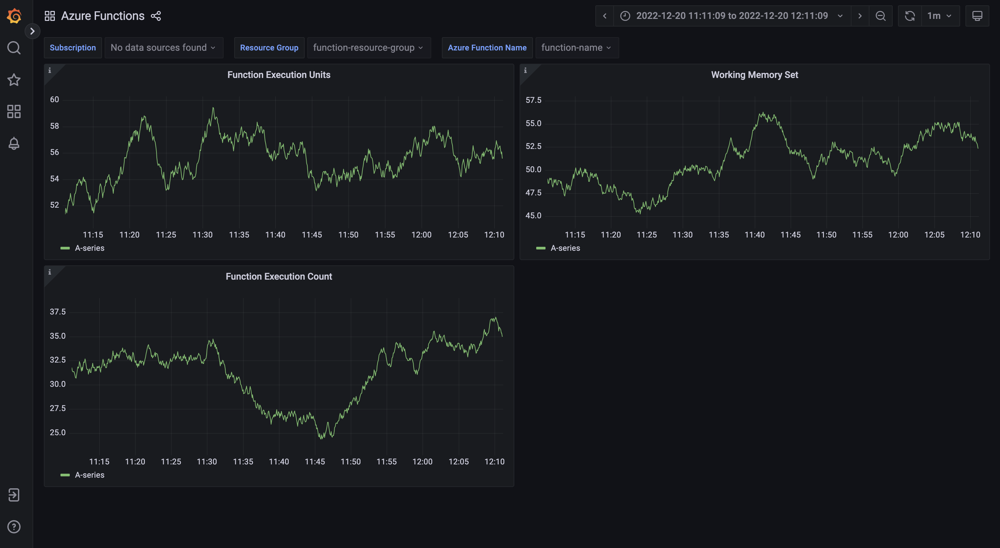

# grafana-dashboards-azure-function
Dynamic grafana dashboards for azure functions, before import the dashboard, you should define azure as a source of grafana.

Here are the links for defining:

* [azure data explorer](https://grafana.com/grafana/plugins/grafana-azure-data-explorer-datasource/)
* or [azure monitor plugin](https://grafana.com/grafana/plugins/grafana-azure-monitor-datasource/)

